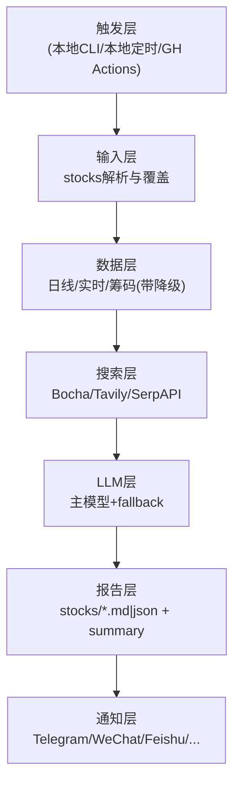

# 功能架构说明

本文档描述 JusticePlutus 的能力边界、模块职责、信源与降级链，便于研发、运维和交接统一口径。

## 1. 总体架构



## 2. 分层能力

### 2.1 触发层

- 本地命令：`python -m justice_plutus run`
- 本地定时：可由 `launchd/cron/Task Scheduler` 托管同一命令
- 远程触发：GitHub Actions `workflow_dispatch`（可选扩展 `schedule.cron`）

### 2.2 输入层

覆盖顺序（高 -> 低）：

1. `workflow_dispatch.stocks`
2. CLI `--stocks`
3. `.env` 的 `STOCK_LIST`
4. 环境变量 `STOCK_LIST`
5. workflow 默认兜底

### 2.3 数据层

| 数据类型 | 主要字段 | 来源链路 |
|---------|----------|----------|
| 日线 | open/close/high/low/volume/amount/ma | `TongHuaShun(iFinD，可用时) -> Tushare -> Efinance -> Akshare -> Pytdx -> Baostock -> YFinance` |
| 实时 | price/volume_ratio/turnover_rate/估值字段 | `TongHuaShun(iFinD，可用时) -> REALTIME_SOURCE_PRIORITY` 顺序尝试，首源成功后补缺字段 |
| 筹码 | profit_ratio/avg_cost/concentration | `HSCloud -> Wencai -> Akshare -> Tushare -> Efinance` |

特性：

- 实时与筹码链路都有熔断器，避免故障源持续拖慢流程
- 单源失败不直接终止，按链路自动切换

### 2.4 搜索层

Provider：

- `Bocha`
- `Tavily`
- `SerpAPI`

策略：

- 多维度并行搜索，单 Provider 失败不阻断主流程
- 保持开放搜索混合源，不与 TongHuaShun 结构化数据能力做 1:1 替换
- 搜索结果进入 LLM prompt 作为风险/利好/业绩依据

### 2.5 LLM 层

Key 策略：

- `AIHUBMIX_KEY` 优先
- 失败后 `OPENAI_API_KEY`

模型策略：

- 主模型：`LITELLM_MODEL`（示例：`openai/gemini-flash-lite-latest`）
- 降级模型：`LITELLM_FALLBACK_MODELS`（示例：`openai/gpt-4o-mini`）

输出：

- 决策仪表盘 JSON（包含核心结论、数据透视、情报、作战计划）

### 2.6 报告与通知层

报告产物：

- `reports/YYYY-MM-DD/stocks/<code>.md`
- `reports/YYYY-MM-DD/stocks/<code>.json`
- `reports/YYYY-MM-DD/summary.md`
- `reports/YYYY-MM-DD/summary.json`
- `reports/YYYY-MM-DD/run_meta.json`

通知出口：

- Telegram（主用）
- 其它通道可按环境变量启用（WeChat/Feishu/Email/Discord/Custom Webhook）

## 3. 降级矩阵

| 位置 | 主路径 | 降级/兜底 |
|------|--------|-----------|
| 日线数据 | TongHuaShun(iFinD，可用时) | 自动切换到 Tushare/Efinance/Akshare/Pytdx/Baostock/YFinance |
| 实时数据 | TongHuaShun(iFinD，可用时) 或优先级首源 | 下一个实时源继续尝试；成功后补缺字段 |
| 筹码数据 | HSCloud | Wencai -> Akshare -> Tushare -> Efinance |
| 搜索增强 | 全 Provider 可用 | 单源失败不阻断 |
| LLM Key | AIHUBMIX_KEY | OPENAI_API_KEY |
| LLM 模型 | LITELLM_MODEL | LITELLM_FALLBACK_MODELS |
| 通知 | 已配置通道发送 | 未配置时只落地本地报告 |

## 4. 配置面（按职责）

### 4.1 输入与运行

- `STOCK_LIST`
- `MAX_WORKERS`
- `REPORT_TYPE`

### 4.2 LLM

- `AIHUBMIX_KEY`
- `OPENAI_API_KEY`
- `OPENAI_BASE_URL`
- `OPENAI_MODEL`
- `LITELLM_MODEL`
- `LITELLM_FALLBACK_MODELS`

### 4.3 数据/搜索

- `TUSHARE_TOKEN`
- `ENABLE_THS_PRO_DATA`
- `ENABLE_CHIP_DISTRIBUTION`
- `WENCAI_COOKIE` / `WENCAI_USER_AGENT`
- `HSCLOUD_AUTH_TOKEN` 或 `HSCLOUD_APP_KEY + HSCLOUD_APP_SECRET`
- `IFIND_REFRESH_TOKEN`
- `BOCHA_API_KEYS`
- `TAVILY_API_KEYS`
- `SERPAPI_API_KEYS`

### 4.4 通知

- `TELEGRAM_BOT_TOKEN`
- `TELEGRAM_CHAT_ID`
- 其它通道变量：见 `.env.example`

## 5. 触发与验收

### 5.1 本地触发

```bash
python -m justice_plutus run --stocks 000001,600519 --no-notify
```

### 5.2 远程触发

```bash
gh workflow run justice_plutus_analysis.yml -f stocks='000001,600519'
gh run list --workflow justice_plutus_analysis.yml --limit 5
gh run watch <run-id> --exit-status
```

验收标准：

- Run 成功
- 报告文件齐全
- 决策仪表盘关键字段完整
