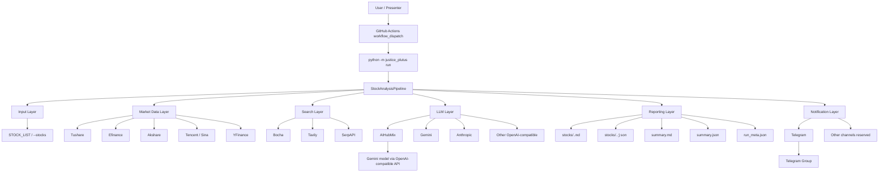
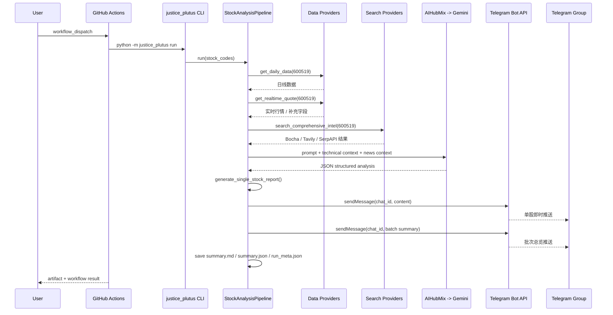

# JusticePlutus 快速开始与分层架构

本文档面向两类场景：

- 第一次接手项目，希望 5 分钟内知道它怎么跑起来
- 需要在分享、演示、汇报时，把输入、路由、输出和回退机制讲清楚

当前已跑通的主路径能力是：

- 可通过本地或 GitHub Actions 触发
- 分析 `STOCK_LIST`（支持 `stocks` / `--stocks` 覆盖）
- 使用 `AIHubMix OpenAI-compatible API + Gemini 模型`
- 使用 `Bocha + Tavily + SerpAPI` 做搜索增强
- 结果可推送到 `Telegram Bot`（其它通道可扩展）

如果这个项目对你有帮助，可以在 GitHub 页面点击 `Sponsor`，或前往 [README 捐赠入口](../README.md#donate) 扫码支持项目继续迭代。

配套文档：

- [API 集成与 OpenClaw 交接说明](API_INTEGRATION_GUIDE.md)
- [OpenClaw / ClawHub Skill 页面](https://clawhub.ai/Etherstrings/justice-plutus)

## 1. 项目定位

`JusticePlutus` 是一个面向 A 股自选股的自动化分析流水线。

它的目标不是做一个大而全的平台，而是先把一条清晰的链路打通：

1. 输入股票代码
2. 拉取行情与技术面数据
3. 拉取新闻与舆情增强信息
4. 调用大模型生成结构化分析
5. 生成本地报告
6. 自动推送到 Telegram 群

当前版本不包含：

- 群里发命令触发分析
- 大盘复盘
- Web 后台交互操作流
- 多通知渠道同时联调

## 当前改股票与触发方式

### 修改默认股票

修改仓库 Variables 中的 `STOCK_LIST`。

示例：

```text
600519,000001,300750
```

### 临时覆盖股票

在 `workflow_dispatch` 运行面板里填写 `stocks`，会覆盖默认 `STOCK_LIST`，但不会改仓库变量。

### 手动触发

打开：

- `https://github.com/Etherstrings/JusticePlutus/actions/workflows/justice_plutus_analysis.yml`

然后点击：

- `Run workflow`

### 定时运行

可以按需选择本地定时或 GitHub 定时。

如果要在 GitHub Actions 上启用定时，在 workflow 的 `on:` 下增加：

```yaml
schedule:
  - cron: "35 1 * * 1-5" # UTC，示例为工作日 09:35 CST
```

本地定时触发命令统一为：

```bash
python -m justice_plutus run
```

本地调度器可任选：

- macOS：`launchd`
- Linux：`cron`
- Windows：Task Scheduler

## 2. 5 分钟快速开始

### 2.1 GitHub Actions 需要的配置

仓库地址：

- `https://github.com/Etherstrings/JusticePlutus`

Secrets 页面：

- `https://github.com/Etherstrings/JusticePlutus/settings/secrets/actions`

Variables 页面：

- `https://github.com/Etherstrings/JusticePlutus/settings/variables/actions`

### 2.2 必填 Secrets

| 名称 | 用途 | 当前首版状态 |
|------|------|-------------|
| `OPENAI_API_KEY` | AIHubMix Key，经 OpenAI-compatible API 调用模型 | 必填 |
| `BOCHA_API_KEYS` | 中文搜索增强 | 建议填 |
| `TAVILY_API_KEYS` | 搜索增强 | 建议填 |
| `SERPAPI_API_KEYS` | Google 搜索补充源 | 建议填 |
| `TELEGRAM_BOT_TOKEN` | Telegram 机器人发消息 | 必填 |
| `TUSHARE_TOKEN` | A 股数据源增强；若权限不足会自动回退 | 建议填 |

### 2.3 必填 Variables

| 名称 | 示例值 | 用途 |
|------|--------|------|
| `OPENAI_BASE_URL` | `https://aihubmix.com/v1` | AIHubMix OpenAI-compatible 入口 |
| `OPENAI_MODEL` | `gemini-flash-lite-latest` | 当前已验证可用的 Gemini 模型 |
| `TELEGRAM_CHAT_ID` | `-1003762251026` | Telegram 群 ID |
| `STOCK_LIST` | `600519` | 自选股输入 |
| `MAX_WORKERS` | `1` | 保证顺序执行、降低限流风险 |
| `REPORT_TYPE` | `simple` | 使用单股即时推送样式 |
| `ENABLE_CHIP_DISTRIBUTION` | `false` | 首版关闭不稳定筹码接口 |

### 2.4 一次手动运行

GitHub Actions 页面：

- `https://github.com/Etherstrings/JusticePlutus/actions/workflows/justice_plutus_analysis.yml`

手动点击：

1. `Run workflow`
2. 如需临时覆盖股票，填写 `stocks`
3. 点击运行

## 3. 一张图看清整体架构



## 4. 运行时交互式流水线

这张图适合在台上解释“触发之后到底发生了什么”。



## 4.1 回退与降级总览

| 层级 | 正常路径 | 降级/回退行为 | 当前线上状态 |
|------|----------|---------------|--------------|
| 输入层 | `STOCK_LIST` 或 `--stocks` | `--stocks` 可临时覆盖 `STOCK_LIST` | 已启用 |
| 日线数据层 | `Tushare -> Efinance -> Akshare -> Pytdx -> Baostock -> YFinance` | 前一源失败自动切下一个；全部失败时仍尝试用已有数据库或最小上下文继续分析 | 已验证 `Tushare` 权限不足时回退到 `Efinance` |
| 实时行情层 | 按 `REALTIME_SOURCE_PRIORITY` 顺序尝试 | 成功拿到基础报价后，可继续用后续源补字段；连续失败的源会进入熔断冷却 | 已启用 |
| 筹码层 | `HSCloud -> Wencai -> Akshare -> Tushare -> Efinance` | 任一源失败继续试下一个；未配置 key/cookie 的源自动跳过；全失败返回 `None`，不阻断主流程 | 按开关启用 |
| 搜索层 | `Bocha / Tavily / SerpAPI` | 单个 provider 或单个维度失败不阻断整只股票分析；失败维度留空继续跑 | 已启用并验证 |
| LLM 层 | `AIHubMix -> gemini-flash-lite-latest` | 代码支持 `LITELLM_FALLBACK_MODELS` 和多模型 Router；当前线上未配置第二模型 | 主路由已验证 |
| 通知层 | Telegram Markdown 消息 | 发送失败自动重试；Markdown 解析失败回退纯文本；多股时最后追加 1 条总览 | 已验证 |

## 5. 分层架构说明

### 5.1 输入层

输入来源有两种：

- `STOCK_LIST`
- `--stocks 600519,000001`

当前首版默认使用：

- `STOCK_LIST=600519`

作用：

- 决定要分析哪些股票
- 作为整条流水线的最上游输入

### 5.2 行情数据层

这是“技术面上下文”的来源层。

当前项目里同层 provider 包括：

- `Tushare`
- `Efinance`
- `Akshare`
- `Tencent/Sina` 实时直连
- `YFinance`
- `Pytdx`
- `Baostock`

它们是同一层级，因为都在解决同一个问题：

- 给股票分析提供价格、成交量、均线、实时行情、补充字段

当前首版的实际运行路径：

- 日线：
  - 优先尝试 `Tushare`
  - 如果账号权限不足，自动回退 `Efinance`
- 实时行情：
  - 主结果可能来自 `Tushare`
  - 缺失字段再由 `Tencent` 补齐

这一层已经实现了两类抗抖动机制：

- **串行 failover**：一个源失败就立即试下一个
- **熔断冷却**：实时行情和筹码接口连续失败后，会暂时跳过该源，避免重复打坏掉的接口

已经验证到的实际行为：

- 当前 `TUSHARE_TOKEN` 在你账号下对 `daily` 接口权限不足
- 但系统成功回退到 `Efinance`
- 整体流程仍可跑通

### 5.3 搜索增强层

这是“新闻、舆情、研报、风险”增强层。

项目支持的同层 provider：

- `Tavily`
- `Bocha`
- `SerpAPI`
- `Brave`（代码层支持，首版 workflow 未启用）

它们的职责相同：

- 输入 query
- 返回结构化搜索结果
- 作为 `news_context` 给 LLM

当前线上已接入并验证：

- `Bocha`
- `Tavily`
- `SerpAPI`

这一层有两个关键点：

1. `search_stock_news()` 是串行回退。
一个 provider 失败后，会继续试下一个 provider。

2. `search_comprehensive_intel()` 是按维度轮询 provider。
也就是说“最新消息”“机构分析”“风险排查”这些维度可能分别落到不同 provider 上；某个维度失败时，该维度会留空，但整只股票不会因此停止分析。

最近一次已验证通过的搜索增强运行：

- `https://github.com/Etherstrings/JusticePlutus/actions/runs/23080051185`

### 5.4 LLM 层

这是最终生成结论的模型层。

需要明确区分两个概念：

- `OpenAI-compatible` 是协议层
- `AIHubMix` 是具体服务商

同层可路由的 LLM 提供方包括：

- `Gemini`
- `Anthropic`
- `AIHubMix`
- 其他 OpenAI-compatible 服务商

当前线上实际走的是：

- `AIHubMix`
- 通过 `OpenAI-compatible API`
- 模型：`openai/gemini-flash-lite-latest`

原因：

- `gemini-flash-latest` 对这把 key 返回 404
- `gemini-flash-lite-latest` 已经实测成功

代码层已经支持：

- `LITELLM_FALLBACK_MODELS`
- 多 key Router
- YAML / channels 配置式路由

但当前 GitHub Actions 线上部署仍是单主模型路线。
这意味着：

- 如果 `AIHubMix` 当前主模型可用，分析正常完成
- 如果主模型完全不可用，单股会退化成失败态分析结果，但整个批次仍继续执行
- 如果你后面希望真正做到模型级自动切换，需要再补一条 `LITELLM_FALLBACK_MODELS` 或第二提供商 key

### 5.5 报告层

LLM 生成结构化结果后，会写出两类文件：

- 单股文件
  - `stocks/600519.md`
  - `stocks/600519.json`
- 本轮汇总文件
  - `summary.md`
  - `summary.json`
  - `run_meta.json`

当前首版是“单股即时推送 + 汇总本地归档”。

### 5.6 通知层

通知层也是一组同层 sender。

项目保留了很多 sender：

- `Telegram`
- `企业微信`
- `飞书`
- `邮件`
- `PushPlus`
- `Server酱3`
- `Discord`
- `自定义 Webhook`
- `Pushover`
- `AstrBot`

但首版实际只验证：

- `Telegram`

原因：

- Telegram 路径已经完整跑通
- 群权限已验证
- 发送成功日志已在 GitHub Actions 中确认

## 6. 当前首版已经验证通过的配置组合

### 6.1 已验证模型组合

| 项目 | 值 |
|------|----|
| 服务商 | AIHubMix |
| 协议 | OpenAI-compatible |
| Base URL | `https://aihubmix.com/v1` |
| 模型 | `gemini-flash-lite-latest` |

### 6.2 已验证通知组合

| 项目 | 值 |
|------|----|
| 通知方式 | Telegram |
| 群 ID | `-1003762251026` |
| 群名 | `JusiticeTEAM` |

### 6.3 已验证搜索组合

| 项目 | 值 |
|------|----|
| 搜索源 | Bocha + Tavily + SerpAPI |
| 使用方式 | 多维情报搜索 |

## 7. 当前运行输出长什么样

单股详情推送样式当前已经改成：

```text
⚪ 贵州茅台 (600519)

📌 核心结论: 均线系统处于空头排列，技术趋势不佳，建议空仓者继续观望，持仓者暂不操作。

📰 重要信息速览
📊 业绩预期: ...
💭 舆情情绪: ...

🚨 风险警报:
风险点1：...
风险点2：...

✨ 利好催化:
利好1：...
利好2：...

📢 最新动态: ...

---
生成时间: 00:41
分析模型: openai/gemini-flash-lite-latest
```

批次总览推送会在所有股票分析完成后再单独发送 1 条：

```text
Jarvis Daily Investment Advice

🎯 2026-03-14 决策仪表盘
共分析5只股票 | 🟢买入:2 🟡观望:2 🔴卖出:1

📊 分析结果摘要
🟢 招商银行(600036): 买入 | 评分 88 | 强烈看多
⚪ 贵州茅台(600519): 观望 | 评分 45 | 看空
...
```

## 8. 为什么首版能跑通

因为它满足了一个最小闭环：

1. 股票输入只有一个：`600519`
2. 并发固定为 `1`
3. 不启用不稳定筹码接口
4. 搜索层虽然能接多 provider，但当前结构仍然清晰可控
5. 模型只接一条可验证的 `AIHubMix -> Gemini`
6. 通知只接 `Telegram`

这个闭环的好处是：

- 变量最少
- 限流风险最小
- 失败定位最清楚
- 演示时不会陷入多 provider 之间的歧义

## 9. 当前验证结果

### 9.1 本地验证

已通过：

- `python -m compileall`
- `pytest`
- 本地 `dry-run`
- 单股报告生成

### 9.2 GitHub Actions 验证

已验证成功的 run：

- `https://github.com/Etherstrings/JusticePlutus/actions/runs/23061254705`
- `https://github.com/Etherstrings/JusticePlutus/actions/runs/23080051185`

从该 run 日志中已确认：

- `已配置 1 个通知渠道：Telegram`
- `已启用单股推送模式：每分析完一只股票立即推送`
- `已配置 Bocha 搜索，共 1 个 API Key`
- `已配置 Tavily 搜索，共 1 个 API Key`
- `已配置 SerpAPI 搜索，共 1 个 API Key`
- `Telegram 消息发送成功`
- `[600519] 单股推送成功`
- `单股推送模式：批次总览推送成功`

## 10. 演示时可以怎么讲

### 10.1 30 秒版本

“JusticePlutus 是一个自选股自动分析流水线。输入股票代码后，它先走行情层拿技术面，再走搜索层补新闻，再把上下文喂给模型层生成结构化结论，最后通过 Telegram 机器人把结果直接发到群里。”

### 10.2 1 分钟版本

“这个系统是分层设计的。最上层是输入层，用 `STOCK_LIST` 或 GitHub Actions 输入传入股票代码；第二层是行情层，用 Tushare、Efinance、Tencent 等 provider 形成技术面上下文；第三层是搜索层，用 Tavily 之类的搜索 API 补齐新闻和舆情；第四层是 LLM 层，现在通过 AIHubMix 的 OpenAI-compatible API 跑 Gemini 模型；最后是通知层，通过 Telegram Bot 自动把分析结果发到群。”

你现在可以把这段更新成：

“这个系统是分层设计的。最上层是输入层，用 `STOCK_LIST` 或 GitHub Actions 输入传入股票代码；第二层是行情层，用 Tushare、Efinance、Tencent 等 provider 形成技术面上下文，而且日线和实时行情都带回退；第三层是搜索层，用 Bocha、Tavily、SerpAPI 分担不同维度的情报搜索，单个维度失败不会阻断整条分析；第四层是 LLM 层，现在通过 AIHubMix 的 OpenAI-compatible API 跑 Gemini 模型；最后是通知层，通过 Telegram Bot 先发单股详情，再补发一条批次总览。”

### 10.3 演示 checklist

正式分享前建议确认：

1. GitHub Actions 变量和 secrets 已配置
2. Telegram bot 在群里有发言权限
3. `OPENAI_MODEL` 仍是可用模型
4. 手动触发一次 workflow，确认 run 成功
5. 群里能收到即时推送

## 11. 后续扩展方向

如果首版闭环已经稳定，第二阶段建议按这个顺序扩展：

1. 把 `STOCK_LIST` 从单股扩成多股
2. 把搜索层从“按维度轮询”进一步升级成“同一维度内串行回退”
3. 增加第二通知渠道
4. 再决定是否做群内命令触发机器人

不要在首版未稳定前同时扩大：

- 股票数量
- 搜索源数量
- 模型提供方数量
- 通知渠道数量

否则定位失败原因会变得很难。
